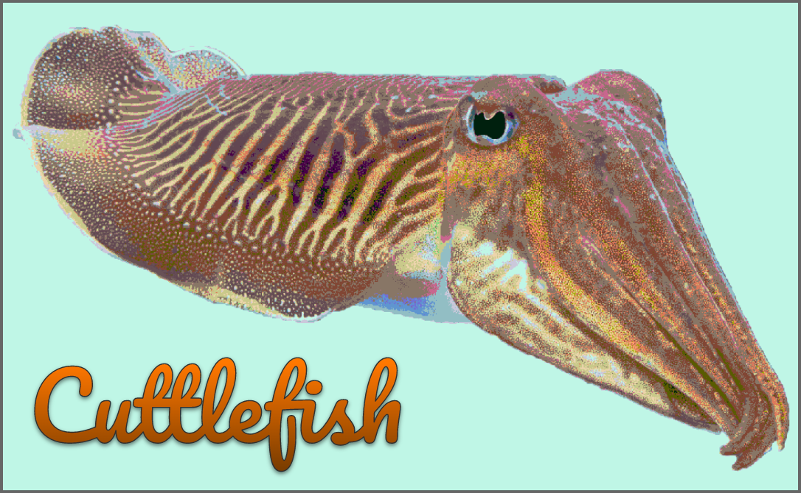

#  The Cuttlefish Programming Language 



Cuttlefish is a dynamically typed functional programming language designed to be the epitome of modern programming practices

Cuttlefish as a language structurally draws from many aspects of Haskell, Elixir, and JavaScript, as well as stylistically from Python, with indentation based closure.

[Here is our website! (Click me!) (Please!)](https://benjaminjkern.github.io/cuttlefishlang) (Not up to date)

# Hello world

```
print "Hello world!"
```

# Basic variables & control flow
```
x = 4
while x > 0:
    x -= 1
    print x

repeat 8:
    print 'printing this 8 times!'

repeat:
    print 'printing forever'
    if x <= 0:
        break

print "Just kidding"
```

# Functions

Here is an example function.

```py
plusSix = fn: x -> x + 6

print plusSix 12 # prints 18

# This would be the same as running this.
print (plusSix(12))
```

One of the things that we did not like about Haskell is the idea that every function is unary and single arity. In order to have an all consuming function such as the print function, you would need to pass a `$` argument, which makes the code more terse and it becomes a problem.

This lends itself nicely to higher-order functions:

```py
twice = fn: (f, x) -> f(f(x))

print twice (plusSix, 7) # prints 19
```

This could have also been accomplished with the following:

```py
print (plusSix * plusSix)(7) # still 19
```

## Pattern matching

Pattern matching is fully implemented in all Routines. The compiler tests for patterns in the order defined at compile time, so that the abstract syntax tree does not have to do any pattern matching.

Here is an example with the factorial function:

```py
factorial = fn:
    0 -> 1
    Int x | x > 0 -> x * factorial (x - 1)
```

The `|` is a guard, and it reads as "such that". In words, the function says:
"Factorial is a function, if the input is a `0` it returns `1`, otherwise if the input is an integer `x` such that `x` is greater than `0`, then it returns `x` times the factorial of `x - 1`. If the input does not match any above patterns, the function will throw an error. If the input is anything else, the function will throw an error."

Here are map and filter implemented in Cuttlefish:


> IFFY ON THIS BIT HERE

Pattern matching can be incredibly expressive for exactly which cases you want to run and how your processes should respond. The patterns are tested against the argument in definition order:

```py
doTaxes = prc:
    Person p | p.debt > 1000 or p.name == 'Karen' ->
        print 'Aint nothin I can do about that'
    Person p ->
        p.debt = 0

    Monster m | m.color == 'green' -> m.eyeballs = 1
    Monster m | m.hasFur -> m.scream()

    Dog d ->
        print 'Dogs dont have to do taxes!'
        d.love += 1

    # This will never match, since every dog matches above
    Dog d | d.love > 100 ->
        d.love -= 1
```

# Discrete Ranges
```py
print [1..10] # [1, 2, 3, 4, 5, 6, 7, 8, 9]

print [0..5] ++ [0..10] # [ 0, 1, 2, 3, 4, 0, 1, 2, 3, 4, 5, 6, 7, 8, 9 ] (Concatenate two ranges)

print [0..-1..-10] # [ 0, -1, -2, -3, -4, -5, -6, -7, -8, -9 ]

print [0..0.7..9] # [ 0, 0.7, 1.4, 2.0999999999999996, 2.8, 3.5, 4.2, 4.9, 5.6000000000000005, 6.300000000000001, 7.000000000000001, 7.700000000000001, 8.4 ]

print [-10 .. (10 + 10)] # [ -10, -9, -8, -7, -6, -5, -4, -3, -2, -1, 0, 1, 2, 3, 4, 5, 6, 7, 8, 9, 10, 11, 12, 13, 14, 15, 16, 17, 18, 19 ]

print [0 .. -1] # [] ( step is 1 here )

print [7..0..10] # [] (I didnt mean to do this but I actually kind of like it, since the other option is a weird infinite loop)

print [7..0..] # [ 7, 7, 7, 7, 7, 7, 7, 7, 7, 7, 7, 7, ... (I kind of like this although I could see someone thinking this is inconsistent)

print [0..] # [ 0, 1, 2, 3, 4, 5, 6, 7, 8, 9, 10, 11, 12, ...

print [0..-1..] # [ 0, -1, -2, -3, -4, -5, -6, -7, -8, -9, -10, -11, ...

# They also work in for loops
for [2..]:
    print isPrime $ # Prints all prime numbers (Requires isPrime to be defined but you get the point)
```

# Expression Operators

The following operators are built in to the language:

| Operator        | Operator Name                                                                                 | Defined For        |
| --------------- | --------------------------------------------------------------------------------------------- | ------------------ |
| `+`/`-`         | Addition and Subtraction                                                                      | Numbers            |
| `*`             | Composition, Multiplication                                                                   | Numbers, Functions |
| `^`             | Compound Composition, Exponentiation                                                          |                    |
| `/`             | Division                                                                                      |                    |
| `++`            | Concatenation                                                                                 |                    |
| `**`            | Compound Concatenation                                                                        |                    |
| `==`            | Equivalence                                                                                   |                    |
| `===`           | Pointer equivalence                                                                           |                    |
| `&`/`|`/`^`/`-` | Intersection, Union, Xor, and Difference set operators (`^` and `-` are used in two patterns) |                    |

As seen in the functions section, the `twice` function is not actually necessary to implement in Cuttlefish, as this code can be written:

```py
print (plusSix * plusSix)(7) # prints 19
```

Similarly, you could also do

```py
print (plusSix * plusSix * plusSix * plusSix)(7) # prints 31
```

This is because `*` is the composition operator. This is the same as running:

```py
print plusSix(plusSix(plusSix(plusSix(7)))) # still 31
```

I know what you're thinking, "But how do you multiply then?"
It's simple. Also with `*`. And it lends itself very nicely to being able to "compose" two numbers together:

```py
print 5(5)   == 25
print (5)5   == 25
print (5)(5) == 25
print 5 5    == 25
print 5 * 5  == 25
# All True

print 55     != 25 # 55 is just 55, so duh its False
```

`^`, then, if we allow to be an exponentiation operator, would make sense to be compounding multiple `*` compositions together!

```py
print 5 ^ 4 == 5 * 5 * 5 * 5
print (f ^ 4)(2) == (f * f * f * f)(2) # Which would also be equal to f(f(f(f(2))))
print 5 ^ 2.5 # 55.90169943749474
# It still works for regular floating point exponentiation!
```
