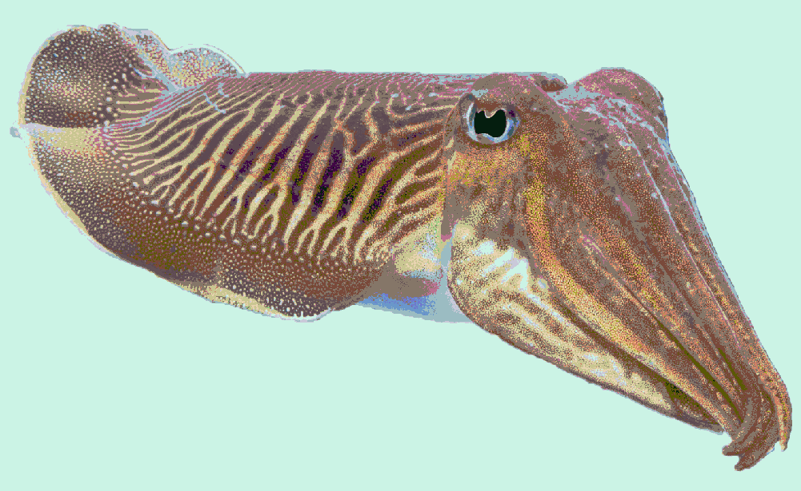
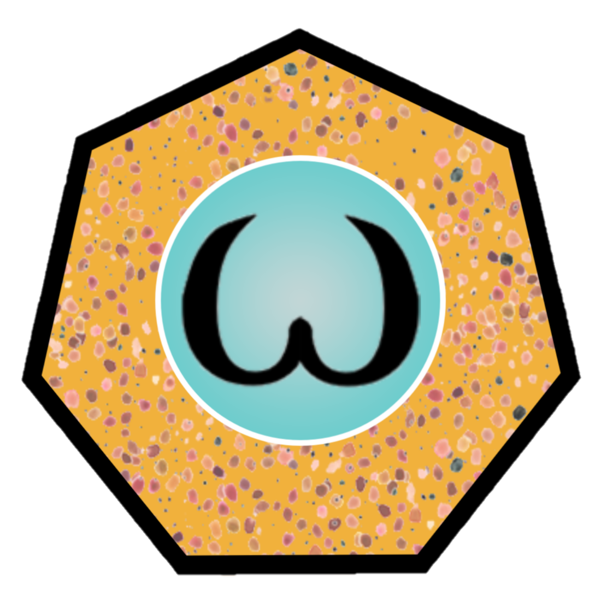

# Cuttlefish, a programming language for the rest of us

Cuttlefish is a strong, statically typed language designed to empower its users to write elegant, safe, and functional code for concurrent systems.

Servers > Processes > Functions
